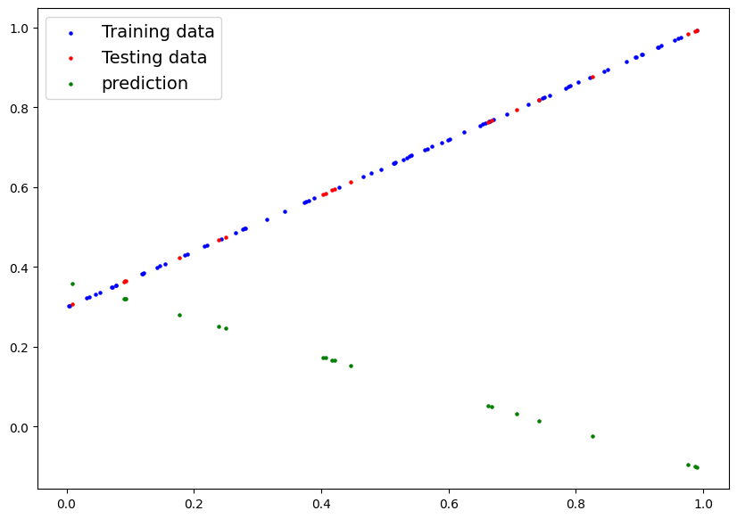
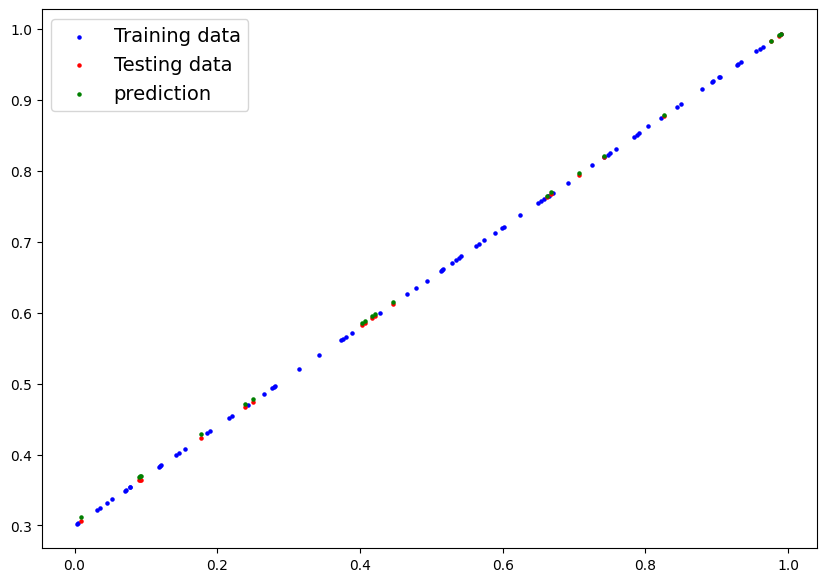

### Hello There 🐼

Let's talk ML model in pytorch 🔥.

___

```python
import torch
import torch.nn as nn
```


#### Pytorch models
1. Inherit `nn.Module` class from pytorch to make any nueral network.
2. Override `forward()` method. This method defines what happens in forward computation.
3. `nn.Parameter` contains what parameters the model should learn.

The above two conditions need to be satisified by any nueral network model in pytorch.

___
### Let's create a linear regression model

#### **what??**

Linear regression is a method where we **predict** the _value_ of a _variable_ depending on some other _variable's value_. For this example we will use a simple linear algebric formula of two variables (`Y = aX + b`).

#### _**Few things to know before we code**_

* We are going to initialize two variables _**weight**_ and _**bias**_ to a random number between 0-1, which will act as part of our linear regression formula. Through training we will adjust the value of _**weight**_ and _**bias**_ to predict the correct value of `Y` in `Y = aX + b` by the model.
* **Cost**: If we consider the output of our model as a number between 0-1, It is the diference between the value of what our model has predicted and what it should have predicted.
* **Gradient descent**: It tells us how much we should change (decrease or increase) our _**weight**_ and _**bias**_ value so that the **cost** of our model is minimized. Or in simple terms how we can make our model predict more accuratley. 
* **Loss function**: It is basically a function which tells us how wrongly our model is performing or predicting the vallue of `Y`. Pytorch 🔥 has some built in loss functions, we will use MEA (Mean Absolute error).
* **Optimiser**: Takes into account the loss a model and adjusts the model's parameters. Here in our case it is _**weight**_ and _**bias**_. Basically tells our model how to update the internal parameters to lower our losses.


#### Let's code

Basic idea of this model is to intialize the **independent** variable to some random number,and then through training we adjust the value of _**weight**_ and _**bias**_ or we can say models parameters.

### **Step-1**:


```python
import torch
import torch.nn as nn
import matplotlib.pyplot as plt
```

For this model we will use a dummy data set of random numbers from 0-1. Following are the code blocks.

```python
X = torch.rand(100)

# output
# tensor([0.7095, 0.0182, 0.6494, 0.4267, 0.7859, 0.1076, 0.5566, 0.0305, 0.8399,
#         0.8249, 0.4304, 0.9033, 0.8297, 0.3878, 0.2044, 0.1138, 0.4107, 0.0159,
#         0.7176, 0.8801, 0.7305, 0.6257, 0.9234, 0.5311, 0.0490, 0.4387, 0.4446,
#         0.5193, 0.2629, 0.3288, 0.9913, 0.7156, 0.5069, 0.7160, 0.1891, 0.9123,
#         0.6346, 0.1371, 0.4527, 0.6871, 0.8393, 0.4437, 0.3672, 0.0039, 0.5439,
#         0.8305, 0.8260, 0.0018, 0.2165, 0.2610, 0.0238, 0.6909, 0.3391, 0.8363,
#         0.3838, 0.8220, 0.9814, 0.5496, 0.7668, 0.8702, 0.3839, 0.0109, 0.9520,
#         0.5634, 0.0310, 0.8753, 0.1028, 0.9014, 0.5311, 0.5681, 0.0084, 0.5314,
#         0.4372, 0.3538, 0.8210, 0.8276, 0.7411, 0.6588, 0.4490, 0.6421, 0.7768,
#         0.8994, 0.2339, 0.2393, 0.9215, 0.3618, 0.1690, 0.4684, 0.6130, 0.8558,
#         0.9995, 0.4142, 0.5015, 0.5818, 0.2044, 0.9882, 0.4949, 0.7489, 0.2483,
#         0.5537])

```

Formula ==> `Y = aX + b`

a ==> weight = 0.7 <br/>
b ==> bias = 0.3

### **Step-2**:

Splitting dataset into _**training**_ and _**testing**_ dataset in 80-20 ratio.

```python
split = int(0.8 * len(data))
X_train, Y_train = data[:split], Y[:split]
X_test, Y_test = data[split:], Y[split:]
```


### **Step-3**:

Creating the model class.

In pytorch every model has to inherit pytorch's `nn.Module`.

```python
# Creating model with name regression
class regression(nn.Module):
  def __init__(self):
    super().__init__()
    self.weights = nn.Parameter(torch.randn(1))
    self.bias = nn.Parameter(torch.randn(1))
  def forward(self,x): 
    return self.weights * x + self.bias
```

```python
# Creating an object of the model
model = regression()
```

In this above code there are few things that need to be understood.
* Our model name is `regression` and it is inheriting pytorch's `nn.Module` which has all the models defined in it. 
* Every model need to overwrite `forward()` method which defines how the nueral network should progress. In our case the `forward()` method is doing the simple linear algebra `Y = aX + b`.


### **Step-4**:

Let's define `plot_graph()` function that will generate a graph for visualization.

```python
def plot_graph(train_data = X_train, train_label = Y_train, test_data = X_test, test_label = Y_test, prediction = None):
  plt.figure(figsize=(10,7))
  plt.scatter(train_data, train_label, c="b", s=5, label="Training data")
  plt.scatter(test_data, test_label, c="r", s=5, label="Testing data")
  if prediction is not None:
    plt.scatter(test_data, prediction, c="g", s=5, label="prediction")
  plt.legend(prop={"size":14})
```


### **Step-5**:

Testing our model's predicting capabilities.

```python
with torch.inference_mode():
  ans = model(X_test)
plot_graph(prediction = ans.detach().numpy())
```



Our model's predictions are completely wrong as it has not been trained. 


### **Step-5**:

We need to create training and testing loop which will train our model to predict the values of `Y` correctly.

```python
# Loss Function
loss_fn = nn.L1Loss()

# Optimizer
optimizer = torch.optim.SGD(params = model.parameters(), lr = 0.01)

# Loss function and Optimizer is explained in the begining of this blog post.
```

```python
# Training loop

epoch = 10000 # Number of time the model has to iterate through the dataset to learn or adjust the value of weight and bias to predict the output correctly.

for e in range(epoch):
  model.train() # Enable trianing mode(gradient tracking)

  # Forward pass
  y_pred = model(X_train)

  # Loss
  loss=loss_fn(y_pred,Y_train)
 
  # Optimize zero grad
  optimizer.zero_grad()

  # Loss backwards(backpropagation)
  loss.backward()

  # Optimize
  optimizer.step()

  model.eval() # Turn off gradient tracking and start testing
  
  with torch.inference_mode():
    
    # Forward pass
    test_pred = model(X_test)

    # Loss
    test_loss = loss_fn(test_pred, Y_test)
```

### **Step-6**:

We check the model's prediction after training.

```python
with torch.inference_mode():
  ans = model(X_test)
plot_graph(prediction = ans.detach().numpy())
```



As you can see in the image our model is predicting almost exact value as our testing dataset.

<br/>

> Few things that i found interesting

* `torch.inference_mode()` -- It is a context manager. This basically speeds up the training of your model by not keeping track of bunch of numbers while training your model. 

<br/>
<br/>

**Good Day**